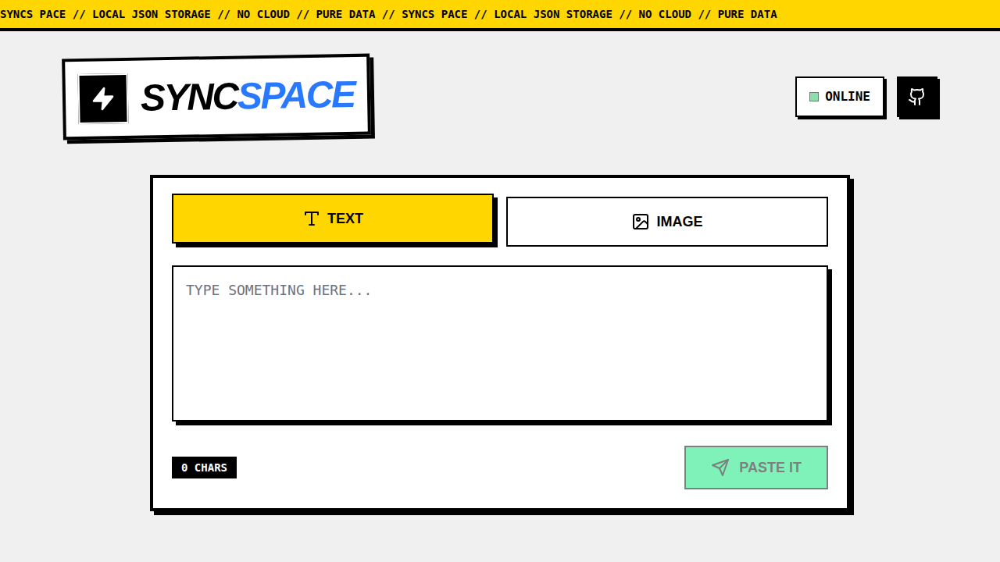
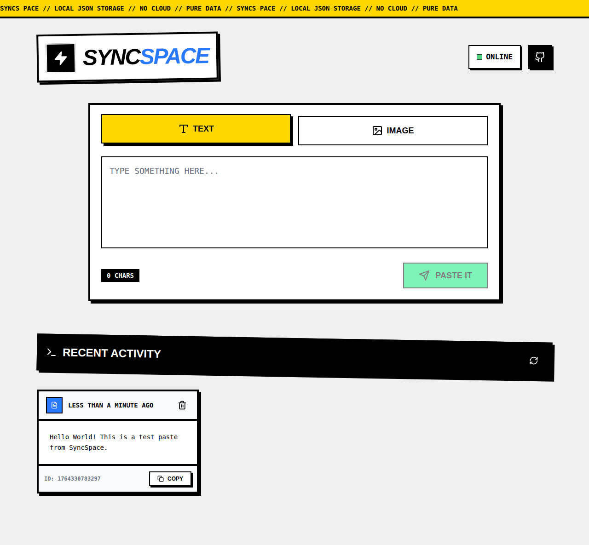
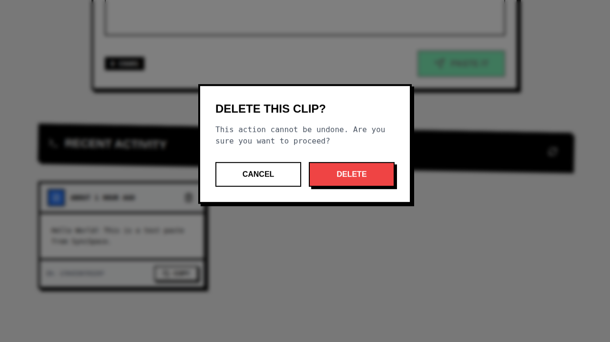

# SyncSpace

A modern clipboard sharing application with local JSON storage. Share text and images instantly across devices.

## Screenshots

### Main Page


### Recent Activity


### Delete Confirmation


## Features

- Share text and images
- Local JSON database storage
- Neo-brutalist UI design
- Real-time updates

## Setup

```bash
npm install
npm run dev
```

This starts both the backend (Port 3000) and frontend (Port 5173).
